# Flowchart Agent — Reference

This file holds the detailed specifications for the Flowchart Agent skill. It is loaded before any diagram is generated.

---

## 1. Supported diagram types

This skill supports 15 Mermaid diagram types covering the full range of essay and research visualization needs.

### Full table

| # | Type | Mermaid keyword | Best for | Avoid when |
|---|---|---|---|---|
| 1 | Flowchart | `flowchart` | Processes, decision trees, causal chains, system flows | Content is inherently temporal, proportional, or relational |
| 2 | Sequence | `sequenceDiagram` | Time-ordered interactions between named actors/systems | No distinct actors; or actors don't interact |
| 3 | Gantt | `gantt` | Timelines with explicit durations and dependencies | Events have no duration (use timeline) |
| 4 | Timeline | `timeline` | Chronological events without durations (history, milestones) | Events have durations or dependencies (use gantt) |
| 5 | Pie | `pie` | Proportion of a single whole into categories | More than ~6 categories (becomes unreadable); or data is absolute, not proportional |
| 6 | Quadrant | `quadrantChart` | 2x2 categorization along two dimensions | More or fewer than 2 dimensions |
| 7 | Mindmap | `mindmap` | Hierarchical concept breakdown, topic decomposition | Content is sequential or causal (use flowchart) |
| 8 | Journey | `journey` | Stakeholder/user experience across a process with sentiment scores | No sentiment/scoring dimension |
| 9 | Sankey | `sankey-beta` | Flow/magnitude between categories (resource/population movement) | Flows lack measurable magnitudes |
| 10 | XY chart | `xychart-beta` | Line or bar charts from numeric data | Data is categorical without numeric values |
| 11 | State | `stateDiagram-v2` | State transitions, lifecycles (policy, system, behavior) | Content is not about discrete states with transitions |
| 12 | ER | `erDiagram` | Entity-relationship diagrams, data models | Not about structured data relationships |
| 13 | Class | `classDiagram` | System architecture, object-oriented structure | Not about software/system structure |
| 14 | Requirement | `requirementDiagram` | Formal requirement mapping (SpecReqs → SysReqs → Implementation) | Informal or non-hierarchical requirements |
| 15 | Block | `block-beta` | Block/architecture diagrams, system partitioning | Content has complex flows (use flowchart) |

### Not supported

`gitGraph`, `packet`, `zenuml`, `architecture-beta`, `radar` — scope-out for this skill.

---

## 2. Type-selection logic

When a slot is marked `SLOT_TYPE: diagram` (generic) or when operating in standalone "let me pick" mode, apply this decision process:

### Step 1 — Identify the primary relationship in the content

Read the DESCRIPTION (or user prompt). What is the content fundamentally *about*?

| Primary relationship | Likely type |
|---|---|
| A → B → C (process, causation) | flowchart |
| Actor X talks to Actor Y at time T | sequence |
| Task X takes Y days, followed by task Z | gantt |
| Event happened in year X, next event in year Y | timeline |
| Category A is X%, Category B is Y% | pie |
| Two independent dimensions split into four quadrants | quadrant |
| Topic → subtopics → sub-subtopics | mindmap |
| User goes through stages with emotional highs and lows | journey |
| X units flow from source A to destination B | sankey |
| Y changes over X (numerical) | xychart |
| System is in state S1, transitions to S2 when event E occurs | state |
| Entity A has relationship R with entity B | er |
| System has components and behaviors | class / block |
| Requirement R must be verified | requirement |

### Step 2 — Check for disqualifiers

For each candidate type, check "Avoid when" in the table above. Eliminate types that don't fit.

### Step 3 — Pick the best match

If multiple types remain viable:
- Prefer the type that matches the user's research context (e.g., if the essay is about policy timelines, prefer `timeline` or `gantt` over `flowchart` even if the description could fit either)
- Prefer the type with cleaner labels for the content (e.g., if descriptions are 3-word phrases, flowchart works; if they're full sentences, mindmap handles it better)
- Prefer simplicity — pick the least complex type that fully conveys the content

### Step 4 — Present and reason

Announce the choice with one-sentence reasoning. Example:

> *"For slot_2 describing 'stakeholder interactions during pilot launch phase,' I recommend `sequence` because the content is explicitly about actors exchanging messages in time order. Proceed, or pick another?"*

Always name the specific reason. Never say "flowchart seems good" without justification.

---

## 3. Mermaid syntax essentials

### Flowchart

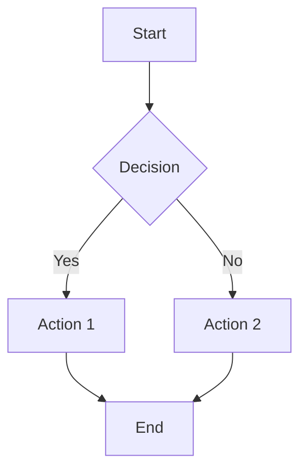

Directions: `TD` (top-down, default), `LR` (left-right), `BT`, `RL`.
Shapes: `A[Rectangle]`, `A(Rounded)`, `A{Diamond}`, `A[[Subroutine]]`, `A[(Database)]`, `A((Circle))`.
Subgraphs via `subgraph "Name"` / `end`.

### Sequence

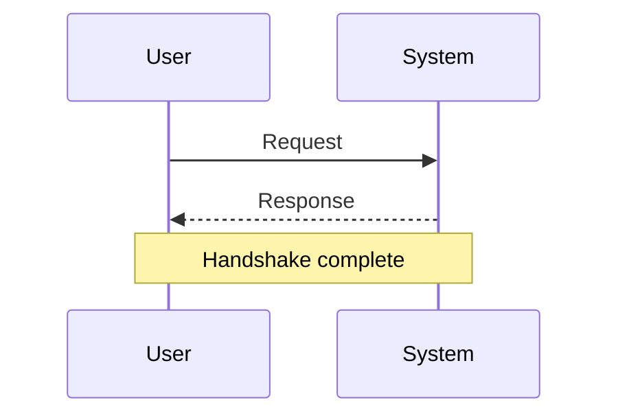

Arrows: `->>` solid, `-->>` dashed return, `-x` error, `-)` async.
Grouping: `alt` / `else` / `end`, `opt` / `end`, `loop` / `end`, `par` / `and` / `end`.
Activations: `A->>+B` activates, `B-->>-A` deactivates.

### Gantt

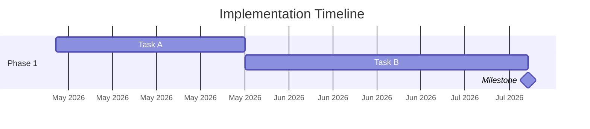

Duration units: `d` (days), `w` (weeks), `M` (months — capital), `h` (hours).
Task status: `:done`, `:active`, `:crit` (critical).

### Timeline

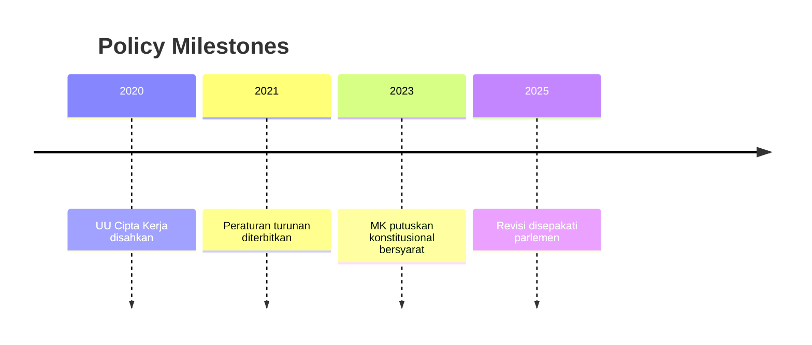

No durations, no dependencies — just chronological anchors.

### Pie

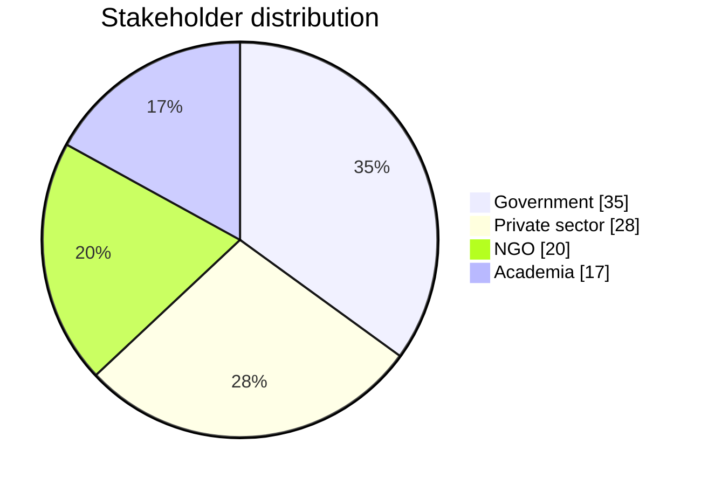

Keep to 3–6 slices for readability.

### Quadrant

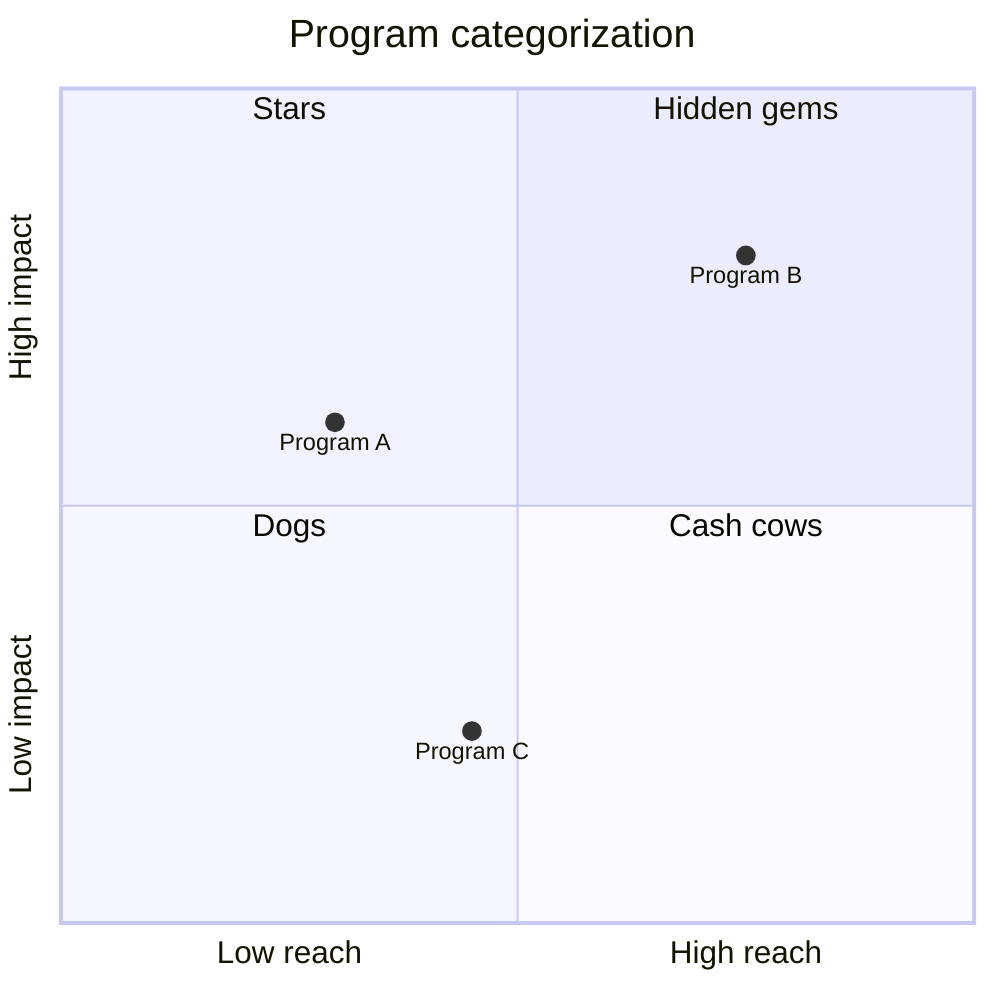

Coordinates are 0–1. Each point's position expresses its score on both axes.

### Mindmap

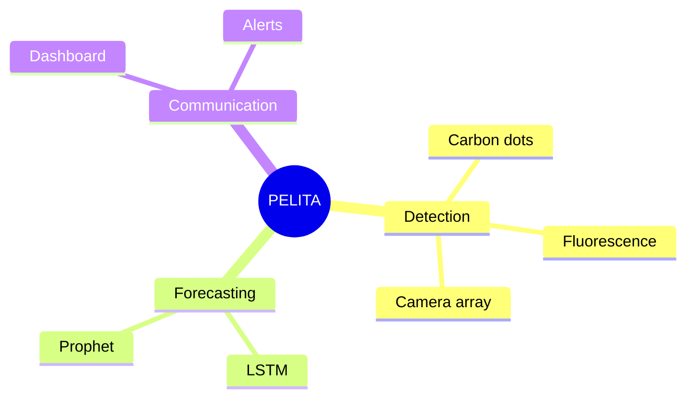

Indentation determines hierarchy. Node shapes: `root((circle))`, `id[rectangle]`, `id(rounded)`, `id))bang((`, `id)cloud(`.

### Journey

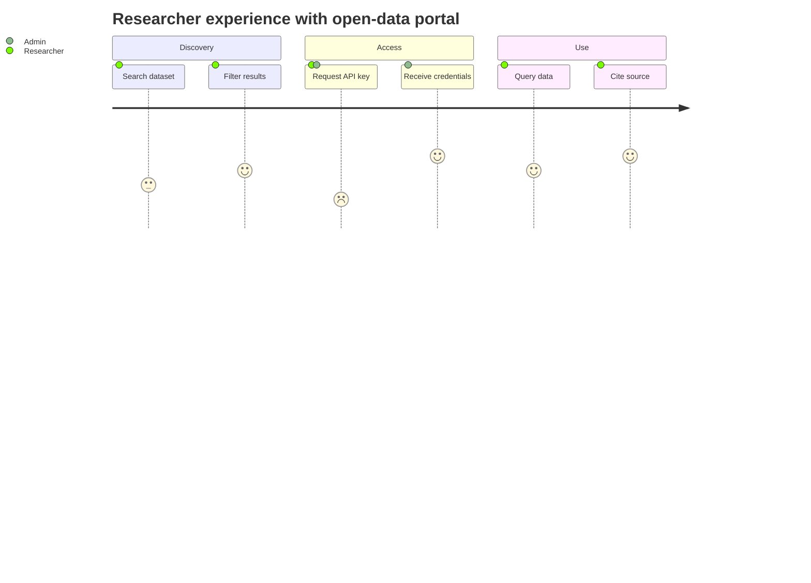

Scores are 1–5 (negative to positive). After the score, list the actors involved.

### Sankey

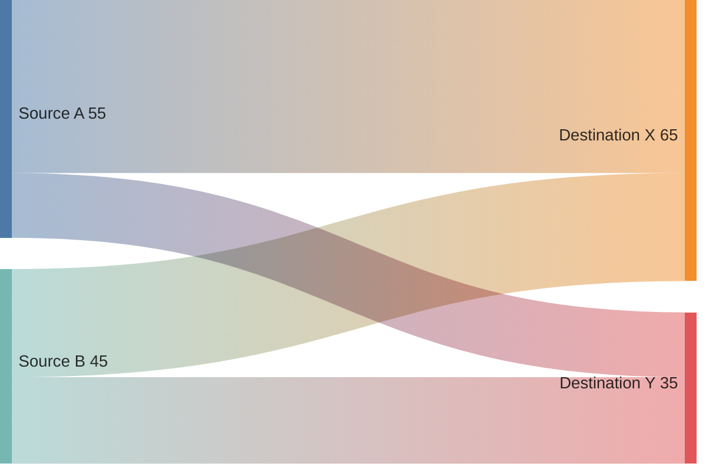

Three CSV columns: source, target, magnitude. Build flows row by row.

### XY chart

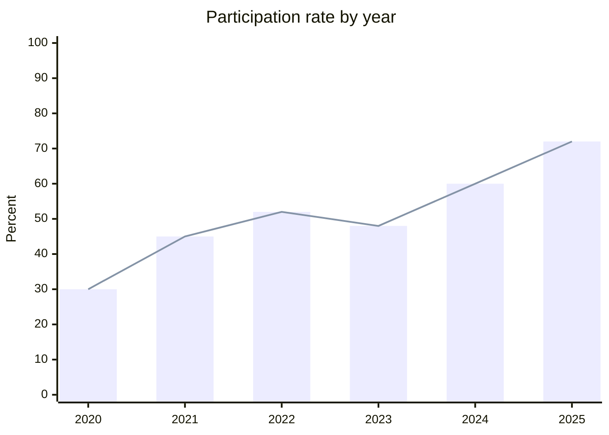

### State

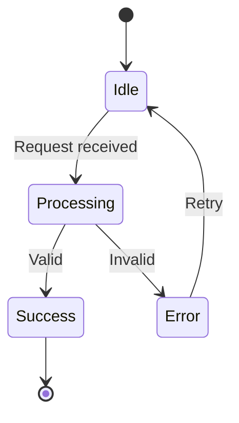

`[*]` is the entry/exit point. Transition labels describe the trigger.

### ER

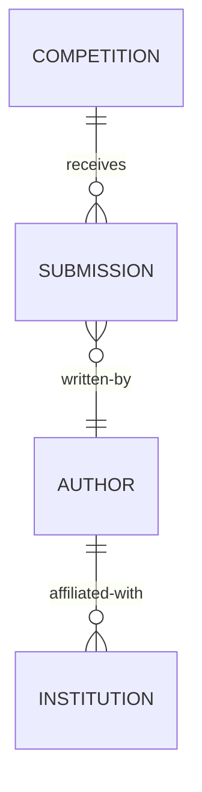

Relationship cardinality: `||` (one), `o|` (zero-or-one), `}o` (zero-or-many), `}|` (one-or-many).

### Class

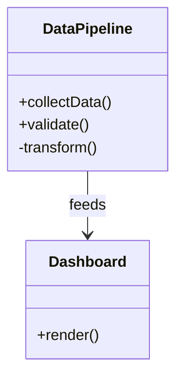

### Requirement

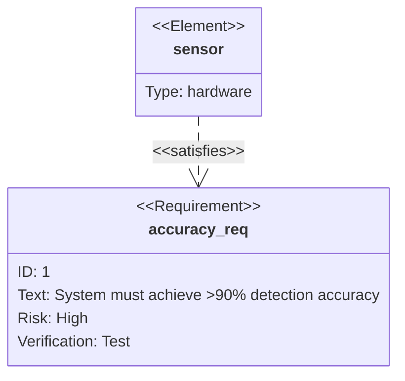

### Block

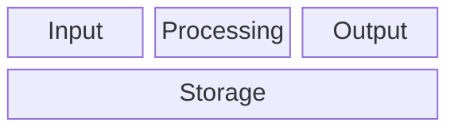

---

## 4. Complexity guidelines

Element counts per complexity level, per diagram type:

| Type | Simple | Moderate | Detailed |
|---|---|---|---|
| Flowchart | 5–8 nodes | 10–15 | 20+ |
| Sequence | 3–5 actors | 5–8 | 9+ |
| Gantt | 4–8 tasks | 9–16 | 17+ |
| Timeline | 4–6 events | 7–12 | 13+ |
| Pie | 3–4 slices | 5–6 | 6 (cap) |
| Quadrant | 4–6 items | 7–10 | 11+ |
| Mindmap | 8–15 nodes | 16–25 | 26+ |
| Journey | 2 sections, 4–6 tasks | 3 sections, 7–12 | 4+ sections, 13+ |
| Sankey | 4–6 flows | 7–12 | 13+ |
| XY chart | 5–8 points | 9–15 | 16+ |
| State | 4–6 states | 7–10 | 11+ |
| ER | 3–5 entities | 6–9 | 10+ |
| Class | 3–5 classes | 6–10 | 11+ |
| Requirement | 3–5 requirements | 6–10 | 11+ |
| Block | 4–8 blocks | 9–14 | 15+ |

### Rules

- Never exceed hard caps that break readability: flowchart 30, sequence 12 actors, pie 6 slices. Offer to split instead.
- Push back if requested complexity forces padding (e.g., "detailed" for a 4-step process).
- If content naturally exceeds the top of a level, offer to split into multiple diagrams or use a hierarchical type (e.g., subgraphs in flowchart).

---

## 5. Color policy — flexible

Colors can aid comprehension. Use them when they add value, not for decoration.

### Three user-selectable tiers (asked upfront)

**Tier 1: Conservative** — minimal color, default Mermaid palette, class-based styling only for 3+ distinct categories.

**Tier 2: Balanced (default)** — colors to aid comprehension where helpful:
- Categorize actor types (in sequence/journey)
- Distinguish phase status (in gantt: done/active/critical)
- Highlight primary path vs. alternatives (in flowchart)
- Distinguish input/process/output (in flowchart)
- Mark critical states vs. steady states (in state diagram)
- Group related nodes via class assignments

**Tier 3: Expressive** — color as a design element:
- Visual identity coherence (e.g., blue-green theme for an environmental essay)
- Theme tints across all diagrams in the same essay (consistency across slots)
- Semantic color meaning (red = risk, green = outcome, amber = caution)
- Decorative but purposeful (e.g., temperature-themed gradient for climate content)

### Rules for all tiers

- **Principle over palette**: every color must have a reason. If you cannot articulate the reason in one sentence, remove the color.
- **Accessibility**: avoid red-green as the only distinction; pair color with shape or label where critical.
- **Excalidraw compatibility**: the user will import to Excalidraw for final editing. Mermaid colors may be stripped or re-themed there; so colors are guidance for the preview, not a final commitment.
- **Cross-slot coherence**: in slot-driven mode, if multiple diagrams appear in the same essay, keep the color scheme consistent across them (same theme tint, same semantic mappings).

### How to apply colors in Mermaid

Via `classDef` and `class`:

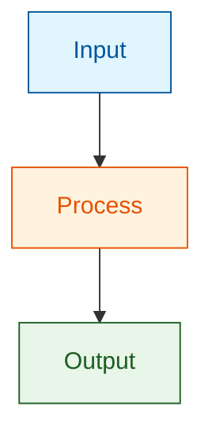

For Gantt statuses, use built-in:
```
Task name :done, a1, 2026-05-01, 30d
Task name :active, a2, after a1, 45d
Task name :crit, a3, after a2, 15d
```

### Palettes by tier

Suggested palettes (any tier can use these — these are starting points, not mandates):

| Use | Hex fills |
|---|---|
| Input / start | `#e1f5fe` (light blue) |
| Process / active | `#fff3e0` (light orange) |
| Output / success | `#e8f5e9` (light green) |
| Error / risk | `#ffebee` (light red) |
| Highlight / primary | `#fff9c4` (light yellow) |
| Neutral / secondary | `#f5f5f5` (light gray) |

---

## 6. Rendering protocol

### Primary method: Mermaid CLI

```bash
mmdc -i {source}.mermaid -o {output}.png -b transparent -t default --width 1400
```

Flags:
- `-i` input file
- `-o` output file
- `-b transparent` transparent background
- `-t default` default theme (use `-t forest` or `-t dark` for variation)
- `--width 1400` readable width; adjust if diagram wraps awkwardly

### Checking availability

```bash
which mmdc || npm list -g --depth=0 | grep mermaid-cli
```

### Installing if missing

If `npm install` is available:
```bash
npm install -g @mermaid-js/mermaid-cli
```

Ask user before installing.

### Fallback chain

1. **mmdc (primary)** — CLI render
2. **mermaid.live (fallback 1)** — save `.mermaid` source, tell user they can render preview at https://mermaid.live/ and download the PNG
3. **Excalidraw direct (fallback 2)** — skip PNG entirely; tell user to import `.mermaid` contents via Excalidraw's Generate → Mermaid to Excalidraw feature, then export PNG from there

### Failure reporting

If primary rendering fails, report verbatim:
- The `mmdc` command attempted
- The stderr output
- Which fallback was used
- The `.mermaid` source path (always saved regardless of render outcome)

### Some diagrams need newer Mermaid

The betas (`sankey-beta`, `xychart-beta`, `block-beta`) need Mermaid CLI v10.3+ for sankey, v10.4+ for xychart, v10.9+ for block. If rendering fails for these, the cause is usually version — suggest updating `@mermaid-js/mermaid-cli`.

---

## 7. Draft modification protocol (slot-driven mode)

### Slot detection

Image slots in the draft follow the Writing Agent's schema:

```
<!-- IMAGE_SLOT_START -->

<!--
SLOT_ID: slot_N
SLOT_TYPE: ...
TARGET_SKILL: flowchart-agent
...
-->
<!-- IMAGE_SLOT_END -->
```

Parse by scanning for `<!-- IMAGE_SLOT_START -->` to `<!-- IMAGE_SLOT_END -->` blocks. Within each, extract the key-value fields from the inner HTML comment.

Match any slot whose `TARGET_SKILL` is `flowchart-agent` (regardless of the specific SLOT_TYPE).

### Versioned backup protocol

Before any write to the draft:

**Scan the folder for existing backups** of the draft version:
- `{draft_stem}.backup.md`
- `{draft_stem}.backup_v1.md`, `.backup_v2.md`, etc.

**Decide the backup path:**

Case 1: No backup exists → create `{draft_stem}.backup_v1.md`

Case 2: Backup(s) exist → ask the user:

> *"Found existing backup(s) for this draft: [list with paths]. Options:*
> *- Overwrite the latest backup ({latest_path})*
> *- Create a new versioned backup ({draft_stem}.backup_v{next_number}.md), preserving all existing backups (default)*
>
> *Which do you prefer?"*

Wait for the user's answer.

Case 3: User chose overwrite → write the backup to the latest existing path, replacing its contents.

Case 4: User chose new version → create `{draft_stem}.backup_v{next_number}.md`. The previous backups remain untouched.

The "next number" is the highest existing version + 1. So if `.backup_v1.md`, `.backup_v2.md`, `.backup_v3.md` exist, create `.backup_v4.md`.

### Placeholder replacement

For each completed slot, replace the `PLACEHOLDER` line only. Do not touch the comment block, except for the SLOT_TYPE update case (below).

**Before:**
```

```

**After:**
```

```

### SLOT_TYPE update (if type changed during type-selection)

If the final type chosen differs from the slot's original SLOT_TYPE, update the comment block:

**Before:**
```
SLOT_TYPE: flowchart
```

**After:**
```
SLOT_TYPE: pie  <!-- changed from flowchart by flowchart-agent 2026-04-22 based on description -->
```

This keeps the history auditable.

### Metadata table update

In the draft's `## Draft metadata → Image slots in this draft` table, update the `STATUS` column and the `TYPE` column for each filled slot:

**Before:**
```
| slot_1 | flowchart | flowchart-agent | Awaiting generation |
```

**After (type unchanged):**
```
| slot_1 | flowchart | flowchart-agent | Filled 2026-04-22 |
```

**After (type changed from flowchart to pie):**
```
| slot_1 | pie (was flowchart) | flowchart-agent | Filled 2026-04-22 |
```

Preserve the rest of the table unchanged.

---

## 8. Output file naming and folder structure

All outputs go to `{competition_folder}/04_diagrams/`. Create this folder if it does not exist.

Naming convention:

```
{competition_folder}/
└── 04_diagrams/
    ├── slot_1_flowchart.mermaid
    ├── slot_1_flowchart.png
    ├── slot_2_pie.mermaid
    ├── slot_2_pie.png
    ├── slot_3_gantt.mermaid
    ├── slot_3_gantt.png
    ├── slot_4_mindmap.mermaid
    ├── slot_4_mindmap.png
    └── ...
```

The filename uses the **final type**, not the slot's original type. If slot_1 was marked `flowchart` but became `pie`, the file is `slot_1_pie.mermaid`.

For standalone mode, use the user's chosen filename but keep the same two-file output:

```
04_diagrams/
├── {user_filename}.mermaid
└── {user_filename}.png
```

---

## 9. Quality checks before saving

Run each item before finalizing. Fix any failure.

### Mermaid validity
- [ ] Every `.mermaid` file renders successfully (or a valid fallback path was used)
- [ ] No syntax errors in Mermaid source
- [ ] Every node has a unique identifier (for flowchart, state, class, ER)
- [ ] Every `participant` declared before use (sequence)
- [ ] Every task has valid start/duration or `after {id}` reference (gantt)
- [ ] Every pie slice has a number (not empty)
- [ ] Every quadrant point has valid [x, y] coordinates in 0–1 range
- [ ] Beta types (`sankey-beta`, `xychart-beta`, `block-beta`) include the `-beta` suffix correctly

### Type appropriateness
- [ ] Chosen type actually fits the content (applied type-selection logic, not pattern-matched)
- [ ] If type was changed from slot's original, reasoning was presented to user and user approved
- [ ] Not forcing content into the wrong type for convenience

### Content fidelity
- [ ] Every slot's PURPOSE is reflected in the diagram
- [ ] Every slot's DESCRIPTION elements appear in the diagram
- [ ] No extraneous content not implied by the slot description
- [ ] `CLAIM_IDS` listed in the slot are visually supported by the diagram's content

### Complexity
- [ ] Element count falls within the chosen level's band for the type
- [ ] Not below the floor or above the hard cap
- [ ] If content exceeded level naturally, user was consulted

### Language consistency
- [ ] All labels in the chosen output language
- [ ] Mermaid keywords left in English (syntax)
- [ ] If essay is Indonesian, no English labels drifted in

### Color policy adherence
- [ ] Colors used only per the chosen tier (conservative/balanced/expressive)
- [ ] Every color has a stated reason
- [ ] Cross-slot color coherence maintained (if slot-driven with multiple slots)
- [ ] No accessibility issues (red-green-only distinctions)

### Draft integration (slot-driven mode only)
- [ ] Backup created, with correct version number per the versioning protocol
- [ ] User consulted if backup conflict existed
- [ ] Every matched slot's placeholder replaced with the correct PNG path
- [ ] SLOT_TYPE in comment block updated if type changed, with note
- [ ] Slot comment markers otherwise preserved intact
- [ ] Metadata table STATUS and TYPE updated
- [ ] No other parts of the draft were modified

### File output
- [ ] Every `.mermaid` source file saved
- [ ] Every matching `.png` saved (or fallback reported)
- [ ] Files are in `{competition_folder}/04_diagrams/`
- [ ] Filenames use the `{SLOT_ID}_{FINAL_TYPE}` convention (slot-driven) or user's chosen name (standalone)

---

## 10. Common failure modes to avoid

- **Silent scope creep**: generating a type not in the 15 supported. If none fits, say so; do not invent.
- **Type mismatch without flagging**: detecting that the slot's SLOT_TYPE doesn't fit the DESCRIPTION but generating the wrong type anyway. Always flag and ask.
- **Pattern-matching type choice**: choosing flowchart just because the DESCRIPTION mentions "process" when the content is really about categories with proportions. Apply the selection logic deliberately.
- **Over-padding to hit complexity**: adding filler nodes to reach "detailed" when content is simple. Push back.
- **Under-specified labels**: "Process," "System," "Component" without naming what specifically. Labels must be concrete.
- **Skipping backup**: modifying the draft without creating a versioned backup. Backup is not optional.
- **Skipping backup-conflict question**: overwriting an existing backup without asking. Always ask in conflict cases.
- **Modifying the comment block** except for the SLOT_TYPE change with note: the comment is auditable metadata; leave other fields alone.
- **Wrong placeholder regex**: replacing text that happens to match `(TBD)` but isn't an image slot. Only match within `<!-- IMAGE_SLOT_START -->` to `<!-- IMAGE_SLOT_END -->`.
- **Mixed languages in one diagram**: labels mixing Indonesian and English when the chosen language was one of them. Commit to the chosen language.
- **Decorative colors without reason**: every color choice must have a one-sentence justification.
- **Fabricated gantt durations or sankey magnitudes**: making up numbers not present in the slot description or research. If data is absent, ask the user before generating.
- **Silent rendering failure**: reporting success when `mmdc` errored. Always report render failures with the actual error.
- **Ignoring the user's Excalidraw workflow**: the `.mermaid` file is the primary deliverable; the PNG is a preview. Do not discard the source file.
- **Cross-slot color incoherence**: using blue-green theme in slot_1 and red-orange in slot_2 in the same essay when user chose expressive tier. Maintain coherence.
